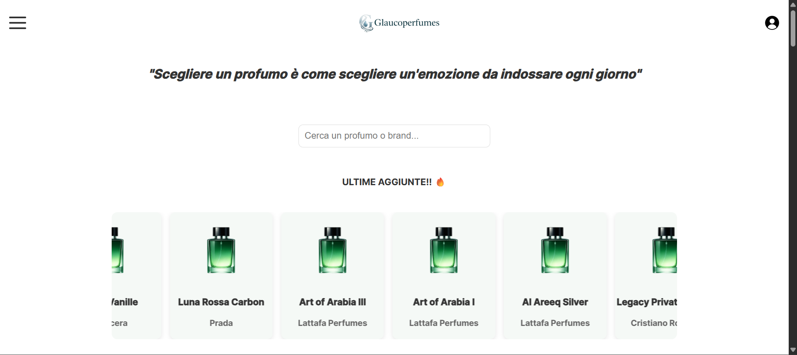
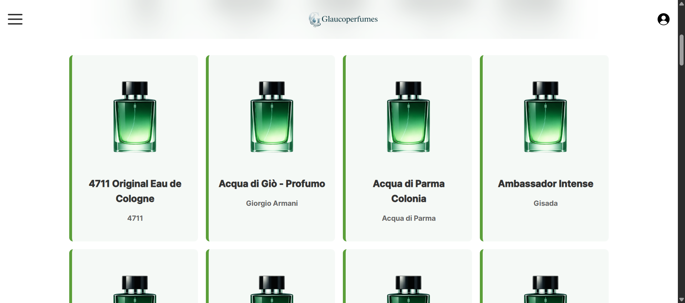
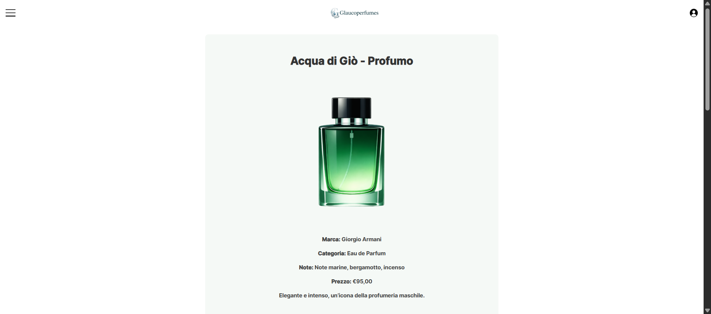
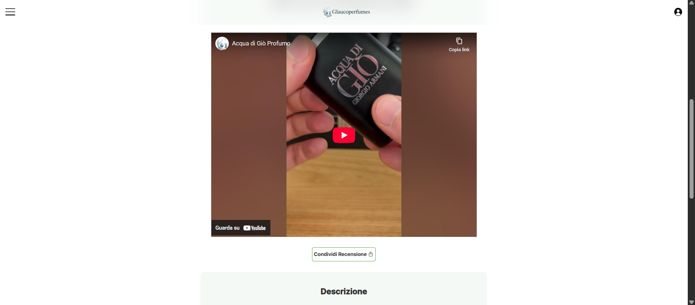
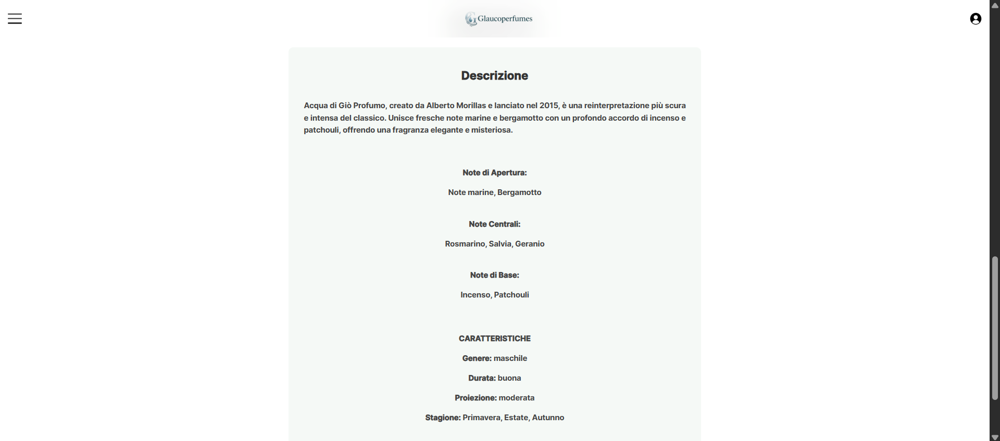

# GlaucoPerfumes

A small front-end web application to explore perfumes through a searchable catalog and detailed fragrance pages.

**Live demo:**
https://enzo-94-prog.github.io/Glaucoperfumes/

---

## Preview

<p align="center">
  
</p>

<p align="center">
  
</p>

---

## What this project is

GlaucoPerfumes is a personal project built to simulate a simple product platform.

Users can browse a catalog of fragrances, open a dedicated page for each perfume and inspect its olfactory pyramid (top, middle and base notes).
The site is not a static showcase: most of the content is generated dynamically and behaves similarly to a small catalog website.

The project was mainly focused on structuring a complete front-end application and organizing it in a way that could later be connected to a real backend.

---

## What you can do

* Browse a perfume catalog
* Open a detail page for each fragrance
* View the full notes pyramid
* Search perfumes by name
* Watch embedded video reviews (when available)
* Navigate both mobile and desktop layouts

---

## Example product page

<p align="center">
  
</p>

<p align="center">
  
</p>

<p align="center">
  
</p>

---

## Try it locally

You can run the project with any static server.

### VS Code (recommended)

Open the folder → right click `index.html` → **Open with Live Server**

### Python

```bash
python -m http.server 8000
```

Then open:
http://localhost:8000

---

## Table of contents

* [Project idea](#project-idea)
* [Tech stack](#tech-stack)
* [Backend simulation via JSON](#backend-simulation-via-json)
* [Project structure](#project-structure)
* [Design choices](#design-choices)
* [Roadmap](#roadmap)
* [Disclaimer](#disclaimer)
* [Final notes](#final-notes)
* [License](#license)

---

## Project idea

The goal of the project was to focus on front-end fundamentals rather than frameworks.

Instead of relying on a library, the application loads data, updates the DOM and reacts to user interaction using plain JavaScript.
The codebase is separated into data, rendering logic and UI interaction, making it easier to maintain and ready for a future API integration.

---

## Tech stack

* HTML5 (semantic structure)
* CSS3 (layout and responsive design)
* Vanilla JavaScript (logic and interaction)
* JSON dataset (`data/perfumes.json`)

No frameworks were used intentionally, in order to work directly with the DOM and understand the mechanisms that frameworks usually abstract.

---

## Backend simulation via JSON

The project does not include a real backend yet.

To avoid a purely static website, all product data is stored inside `perfumes.json`.
JavaScript reads the dataset and uses it to render the catalog, generate the detail page and handle search.

In practice the JSON file acts as a small local database.

This mirrors how a frontend normally consumes an API, so the same logic could later fetch data from a server with minimal changes.

The idea was to first build a solid understanding of client-side rendering and state handling, then extend the project with server-side technologies.

---

## Project structure

```
Glaucoperfumes/
│
├── index.html
├── perfume.html
│
├── data/
│   └── perfumes.json
│
├── js/
│   ├── main.js
│   ├── render.js
│   └── search.js
│
├── css/
│   └── style.css
│
├── img/
│   └── bottle.png
│
└── docs/
    ├── home-1.png
    └── home-2.png
```

---

## Design choices

**JSON-driven catalog**
Adding a perfume only requires inserting a new object into the dataset. No HTML duplication is needed.

**No framework**
The purpose is to demonstrate understanding of DOM manipulation, events and rendering logic before relying on tools that automate them.

**Placeholder images**
Official product photos are copyrighted marketing assets.
To keep the repository publicly shareable, each item uses a project-owned placeholder image (`img/bottle.png`).

---

## Roadmap

Possible future improvements:

* Filtering by brand or fragrance family
* Favorites using LocalStorage
* Pagination or lazy loading
* Replace JSON with a real API
* User accounts and reviews

---

## Disclaimer

All trademarks and brand names belong to their respective owners.
This project is for educational and portfolio purposes only and is not affiliated with any fragrance brand.

---

## Final notes

The repository is intended to show project organization and reasoning, not only visual layout.

The most relevant files for review are:

* `data/perfumes.json` (data model)
* `js/` (rendering and search logic)
* `css/style.css` (responsive layout)

---

## License

This project is licensed under the MIT License.
A `LICENSE` file containing the full text is included in the repository.
